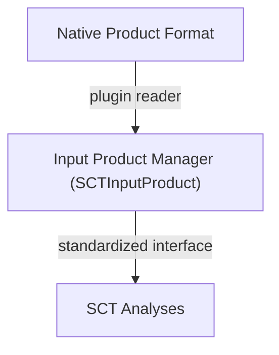

# Internal Structure

Every plugin must implement the ``sct.plugins.protocols.InputProductPluginProtocol``.

A minimal implementation looks like the following:

```python title="SCT Plugin Compliant Class"

from sct.io.extended_protocols import (
    ALECorrectionFunctionType,
    SCTInputProduct
)
from sct.plugins.protocols import InputProductPluginProtocol
from sct_<product_name>_reader import __version__  # (1)!

class <ProductName>Plugin(InputProductPluginProtocol):  # (2)!

    version = __version__

    @classmethod
    def get_manager(cls) -> type[SCTInputProduct]:
        """Return the class of the input product manager."""

    @classmethod
    def get_detector(cls) -> Callable[[str | Path], bool]:
        """Return a function that returns True if the given product
        can be read by this plugin."""

    @classmethod
    def get_ale_corrector(cls) -> ALECorrectionFunctionType:
        """Return the function that corrects the ALE errors in
        the product, if any."""
```

1.  Substitue ``<product_name>`` with  
    the name of the product.
2.  Substitute ``<ProductName>`` with  
    the name of the product.


The plugin is responsible for:

- Determining whether a product belongs to the supported format
- Creating a reader object capable of exposing the required data
- Adapting the native product structure to the format expected by SCT analyses

The ``version`` attribute should contain the version of the plugin package. This is typically imported from the package init.

Keeping track of the plugin version helps SCT:

- ensure compatibility between plugins and the core framework
- improve reproducibility of analysis results
- assist debugging and reporting

## Input Product Manager

The class method ``sct.plugins.protocols.InputProductPluginProtocol.get_manager`` must return a class that must be compliant to
the ``sct.io.extended_protocols.SCTInputProduct`` protocol.

The returned class is the **input product manager**, which is responsible for:

- opening the product files
- parsing the native product structure
- exposing the product data through the **standard SCT data model**

The manager therefore acts as an **adapter layer** between the product format and the analysis modules.

Conceptually:



## Internal Data Model

All analyses in SCT expect their inputs to follow a **common internal data model**. This model is defined through the
class ``sct.io.extended_protocols.SCTInputProduct`` protocol and related protocol definitions.

The manager returned by class method ``sct.plugins.protocols.InputProductPluginProtocol.get_manager`` must therefore implement
all the attributes and methods required by these protocols.

This ensures that:

- analyses can run **independently of the original product format**
- different satellite products can be processed using the **same analysis code**
- new product formats can be supported simply by providing a compatible manager

In practice, the input product manager translates the native product data into the structures required by SCT analyses.

## Registering the Plugin

To allow SCT to discover the plugin automatically, the plugin class must be registered through a **Python entry point**.

In your ``pyproject.toml`` file:

```toml title="pyproject.toml"

[project.entry-points."sct.input_products"]
myproduct = "sct_<product_name>_reader.interface:<ProductName>Plugin"
```

Where:

- ``sct.input_products`` is the **entry point namespace** used by SCT.
- ``<product_name>`` is the plugin identifier.
- ``sct_<product_name>_reader.interface:<ProductName>Plugin`` is the import path to the plugin class.

When SCT starts, the plugin loader will scan this namespace using ``stevedore`` and automatically import all available
plugins.

??? info "Example"

    💡 This registers the class ``EOS04ProductPlugin`` as a plugin for SCT.

    ```toml title="pyproject.toml"
    [project.entry-points."sct.input_products"]
    aresys = "sct_eos04_reader.interface:EOS04ProductPlugin"
    ```

## Plugin Discovery

At runtime, SCT uses [OpenStack's stevedore](https://docs.openstack.org/) to discover and load plugins:

```python title="Plugin discovery"
from stevedore import ExtensionManager

manager = ExtensionManager(
    namespace="sct.input_products",
    invoke_on_load=True,
    on_load_failure_callback=_on_load_failure
)
```

- Namespace must match the entry point group defined in each plugin’s ``pyproject.toml``.
- *invoke_on_load=True* imports the plugin immediately.
- Any plugin that fails to load triggers the failure callback.

All installed packages exposing entry points in the ``sct.input_products`` namespace are loaded automatically.

No manual registration is required. After installation, SCT will automatically detect the plugin during startup.

## Best Practices

When developing a plugin:

- Keep **product-specific logic isolated** inside the plugin package.
- Avoid introducing dependencies into the core SCT package.
- Provide **unit tests** using representative product samples.
- Clearly document the supported product version and sensor.

## Distribution

Plugins can be distributed independently from SCT via PyPI or internal/local package repositories.

This allows users to install only the plugins required for the specific products they want to analyze.
